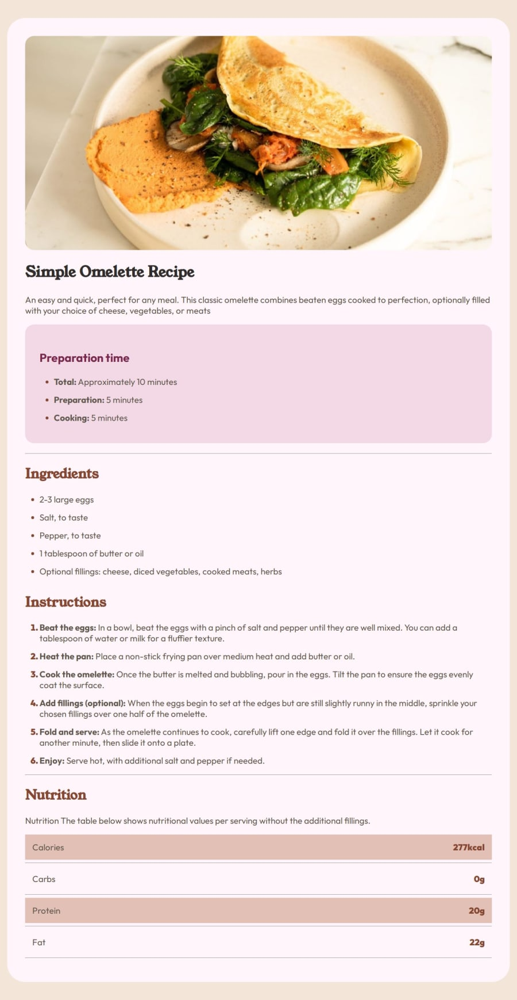

# Página de Receitas

Este é um projeto proposto pelo Frontend Mentor, construído exclusivamente com HTML e CSS, destacando-se pela ênfase na responsividade. O desafio proposto pelo Frontend Mentor visa aprimorar habilidades de design e desenvolvimento frontend.

<a href="https://page-receitas-one.vercel.app/">Link do Projeto</a>

